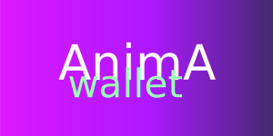

## Anima Wallet

A crypto wallet for the Aptos ecosystem.

<!--  -->

## Based on Tauri-Wallet
A framework for crypto wallets using Rust and Typescript, thanks to Tauri and Svelte.

This is a skeleton for building wallets it comes with certain features out of the box.

- [x] Builds Windows, MacOs, Linux apps for distribution.
- [x] Auto-updating app over the air.
- [x] Uses the OS keyring to store private keys.
- [x] Scaffold for signing transactions in memory-safe Rust environment.
- [x] Account profile creation an saving to disk.
- [x] Multi-account by default.
- [x] Set "playlists" of fullnode peers to connect to. 
- [x] Developer debugging view.
## Development

If you are a developer and want to contribute to the project, please continue with the [development environment setup](docs/devs/get-started.md).
